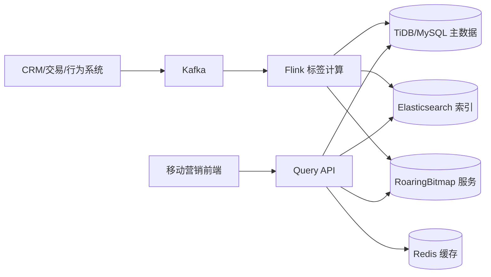

# 客户标签筛选系统详细技术方案（Elasticsearch 版）

## 1. 背景与目标

### 1.1 业务背景
- 客户规模约 **3000 万**。
- 标签规模约 **200+**，由客户业务属性计算生成。
- 业务员端需要高频查询“名下客户 + 标签信息”。
- 支持 200+ 标签的多条件组合筛选（AND / OR / NOT）。

### 1.2 目标
- 在高并发下提供低延迟筛选体验。
- 标签变更秒级可见（最终一致）。
- 架构可水平扩展，支持后续规模增长。

### 1.3 建议指标
- 查询延迟：`P95 < 200ms`，`P99 < 400ms`。
- 标签更新可见性：`< 5s`。
- 查询服务可用性：`99.95%+`。

---

## 2. 总体架构（Elasticsearch 版）



分层职责：
- **TiDB/MySQL**：客户主档、标签定义、审计快照。
- **Kafka + Flink**：实时标签计算、增量同步。
- **Elasticsearch**：过滤、排序、分页、聚合。
- **RoaringBitmap**：复杂标签组合预过滤与计数。
- **Redis**：短时缓存与热点保护。
- **Query API**：统一查询入口、执行计划、降级策略。

---

## 3. 数据模型设计

## 3.1 关键 ID
- `cust_id`：业务主键（对外标识）。
- `cust_int_id`：内部稠密整型 ID（位图计算使用）。
- `salesman_id`：业务员主过滤键。

> 建议维护 `cust_id <-> cust_int_id` 映射，支持批量转换。

## 3.2 关系库表示意

### `customer_profile`
- `cust_id` (PK)
- `cust_int_id` (UNIQUE)
- `salesman_id` (INDEX)
- `name`, `mobile_masked`, `region`, `level`, `status`
- `last_active_time`, `updated_at`

### `customer_tag_snapshot`
- `cust_id` (PK)
- `tag_ids_json`
- `tag_version`
- `updated_at`

### `tag_definition`
- `tag_id` (PK)
- `tag_code` (UNIQUE)
- `tag_name`
- `calc_type`
- `rule_version`
- `enabled`

---

## 4. Elasticsearch 索引设计

## 4.1 Index Template（示例，ES 8.x）

```json
PUT _index_template/customer-search-template-v1
{
  "index_patterns": ["customer_search_v1*"],
  "template": {
    "settings": {
      "number_of_shards": 36,
      "number_of_replicas": 1,
      "refresh_interval": "1s"
    },
    "mappings": {
      "dynamic": "strict",
      "properties": {
        "cust_id": {"type": "keyword"},
        "cust_int_id": {"type": "long"},
        "salesman_id": {"type": "keyword"},
        "tags": {"type": "keyword"},
        "name": {"type": "keyword"},
        "region": {"type": "keyword"},
        "level": {"type": "keyword"},
        "status": {"type": "keyword"},
        "last_active_time": {"type": "date"},
        "updated_at": {"type": "date"},
        "tag_version": {"type": "long"}
      }
    }
  },
  "priority": 100
}
```

## 4.2 分片与路由建议
- 30M 文档建议起步 `24~48` 主分片（按节点容量调优）。
- 副本建议 `1` 起步，兼顾可用性与读吞吐。
- 使用 `routing=salesman_id`，减少跨分片查询开销。
- 单分片建议控制在 `20~50GB`。

## 4.3 查询规范
- 所有筛选条件走 `bool.filter`，避免评分开销。
- 分页使用 `search_after`，避免深分页性能退化。
- `_source` 只返回列表必需字段，详情按需回源。

---

## 5. 标签筛选加速（RoaringBitmap）

## 5.1 Key 设计
- `bm:salesman:{salesman_id}`：业务员客户集合。
- `bm:tag:{tag_id}`：标签客户集合。
- （可选热点）`bm:salesman:{salesman_id}:tag:{tag_id}`。

## 5.2 组合筛选逻辑
给定：
- `must_tags=[T1,T8]`
- `should_tags=[T3,T5]`
- `must_not_tags=[T9]`

计算：
1. `S = bm:salesman:{id}`
2. `M = bm:tag:T1 AND bm:tag:T8`
3. `O = bm:tag:T3 OR bm:tag:T5`（可选）
4. `N = bm:tag:T9`
5. `R = S AND M AND O AND NOT N`

`R` 作为候选集供 Elasticsearch 做排序分页。

## 5.3 Facets 计数
- `count(tag_i)=cardinality(Base AND bm:tag:i)`。
- 200 标签并行分批计算，结果缓存 10~30 秒。

---

## 6. Query API 设计

## 6.1 检索接口
`POST /api/v1/customers/search`

请求示例：
```json
{
  "salesman_id": "S10086",
  "must_tags": ["T1", "T8"],
  "should_tags": ["T3", "T5"],
  "must_not_tags": ["T9"],
  "filters": {"region": ["CN-SH"], "level": ["A", "B"]},
  "sort": [{"last_active_time": "desc"}, {"cust_int_id": "asc"}],
  "page_size": 50,
  "cursor": "opaque-token"
}
```

## 6.2 Elasticsearch DSL（示例）

```json
POST customer_search_v1/_search?routing=S10086
{
  "size": 50,
  "track_total_hits": false,
  "_source": ["cust_id", "name", "region", "level", "tags", "last_active_time"],
  "query": {
    "bool": {
      "filter": [
        {"term": {"salesman_id": "S10086"}},
        {"terms": {"tags": ["T1", "T8"]}},
        {"terms": {"region": ["CN-SH"]}},
        {"terms": {"level": ["A", "B"]}}
      ],
      "must_not": [
        {"term": {"tags": "T9"}}
      ],
      "should": [
        {"term": {"tags": "T3"}},
        {"term": {"tags": "T5"}}
      ],
      "minimum_should_match": 1
    }
  },
  "sort": [
    {"last_active_time": "desc"},
    {"cust_int_id": "asc"}
  ],
  "search_after": [1720000000000, 123456]
}
```

> 注意：`must_tags` 在严格场景下建议展开为多个 `term` 条件，而不是单个 `terms`，以确保“必须全部命中”。

## 6.3 自适应执行计划
1. **纯 ES 模式**：简单筛选且候选集较大。
2. **Bitmap + ES 模式**：复杂标签表达式或高并发热点。
3. **降级模式**：Bitmap 异常时回退纯 ES；聚合超时时关闭 facets。

---

## 7. 实时标签计算与同步

## 7.1 数据流
1. 多源业务事件进入 Kafka。
2. Flink 按 `cust_id` 计算标签增量。
3. Sink 同步：
   - Upsert 到 Elasticsearch；
   - Bitmap add/remove；
   - 可选写审计快照表。

## 7.2 一致性控制
- 查询侧采用秒级最终一致。
- 以 `(cust_id, tag_version)` 实现幂等。
- 新版本覆盖旧版本，避免乱序写入污染。

---

## 8. 缓存、限流与稳定性

## 8.1 Redis 缓存
- 结果页缓存：`query_hash+cursor`（TTL 10~30 秒）。
- facets 缓存：`query_hash`（TTL 10~30 秒）。
- 标签定义缓存：分钟级 TTL。

## 8.2 稳定性策略
- 业务员维度限流与舱壁隔离。
- Elasticsearch 查询超时控制与熔断。
- 热点查询短缓存 + 本地缓存兜底。

---

## 9. Elasticsearch 运维重点

## 9.1 ILM 生命周期管理（示意）
- 对历史低频索引做 warm/cold 迁移（若按时间分索引）。
- 对只读历史分片做 forcemerge 降成本。

## 9.2 监控指标
- 查询延迟、QPS、错误率、超时率。
- JVM heap、GC、线程池拒绝、segment merge。
- 慢查询日志与热点分片分布。

## 9.3 安全
- 使用 Elasticsearch Security（TLS、用户/角色、索引级权限）。
- API 层强制业务员数据权限校验。
- 返回字段脱敏（手机号、证件号等）。

---

## 10. 容量与压测

## 10.1 容量估算
- 索引容量 ≈ `文档数 * 文档平均大小 * (1 + 副本数) * 开销系数`。
- 结合保留周期和分片规划估算节点资源。

## 10.2 压测维度
- 按业务员规模分层：小/中/大客户池。
- 按标签复杂度：1、5、20 条件组合。
- 按流量形态：稳态并发 + 突发流量。

---

## 11. 与 OpenSearch 的差异清单（落地关注）

1. **安全模型**：OpenSearch Security 与 ES X-Pack 配置项不同。
2. **生命周期管理**：ISM（OpenSearch）与 ILM（ES）语法不同。
3. **客户端依赖**：需替换为 ES 官方客户端版本。
4. **插件能力**：告警、SQL、向量能力差异需单独核对。
5. **许可证合规**：需按企业政策确认 Elastic License 合规。

---

## 12. 分阶段实施建议

### Phase 1：基础版
- 建立 `TiDB/MySQL + Kafka/Flink + Elasticsearch` 主链路。
- 打通客户检索、标签筛选、权限校验、游标分页。

### Phase 2：性能版
- 引入 RoaringBitmap 预过滤与 facets 加速。
- 增加缓存、热点隔离、降级体系。

### Phase 3：治理版
- 标签规则平台化（版本、灰度、回放）。
- 完成离线对账与自动修复闭环。

---

## 13. 验收标准

- [ ] 支持业务员名下客户检索与 200+ 标签组合筛选。  
- [ ] 常见检索 `P95 < 200ms`。  
- [ ] 标签变更可见延迟 `< 5s`。  
- [ ] 组件异常时可自动降级且不影响核心查询。  
- [ ] 完成压测、监控、容灾演练与审计记录。  

