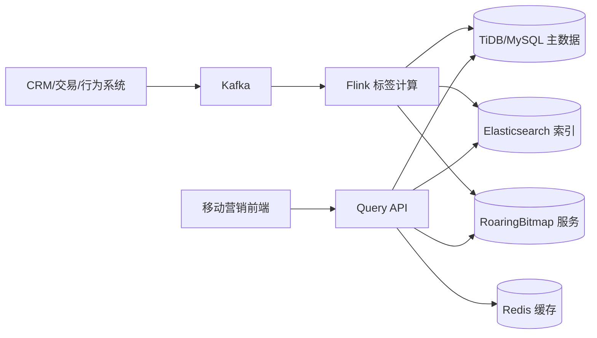

# 客户标签筛选系统详细技术方案（Elasticsearch 版）

## 1. 背景与目标

### 1.1 业务背景
- 客户规模约 **3000 万**。
- 标签规模约 **200+**，由客户业务属性计算生成。
- 业务员端需要高频查询“名下客户 + 标签信息”。
- 支持 200+ 标签的多条件组合筛选（AND / OR / NOT）。

### 1.2 目标
- 在高并发下提供低延迟筛选体验。
- 标签变更秒级可见（最终一致）。
- 架构可水平扩展，支持后续规模增长。

### 1.3 建议指标
- 查询延迟：`P95 < 200ms`，`P99 < 400ms`。
- 标签更新可见性：`< 5s`。
- 查询服务可用性：`99.95%+`。

---

## 2. 总体架构（Elasticsearch 版）



分层职责：
- **TiDB/MySQL**：客户主档、标签定义、审计快照。
- **Kafka + Flink**：实时标签计算、增量同步。
- **Elasticsearch**：过滤、排序、分页、聚合。
- **RoaringBitmap**：复杂标签组合预过滤与计数。
- **Redis**：短时缓存与热点保护。
- **Query API**：统一查询入口、执行计划、降级策略。

---

## 3. 数据模型设计

## 3.1 关键 ID
- `cust_id`：业务主键（对外标识）。
- `cust_int_id`：内部稠密整型 ID（位图计算使用）。
- `salesman_id`：业务员主过滤键。

> 建议维护 `cust_id <-> cust_int_id` 映射，支持批量转换。

## 3.2 关系库表示意

### `customer_profile`
- `cust_id` (PK)
- `cust_int_id` (UNIQUE)
- `salesman_id` (INDEX)
- `name`, `mobile_masked`, `region`, `level`, `status`
- `last_active_time`, `updated_at`

### `customer_tag_snapshot`
- `cust_id` (PK)
- `tag_ids_json`
- `tag_version`
- `updated_at`

### `tag_definition`
- `tag_id` (PK)
- `tag_code` (UNIQUE)
- `tag_name`
- `calc_type`
- `rule_version`
- `enabled`

---

## 4. Elasticsearch 索引设计

## 4.1 Index Template（示例，ES 8.x）

```json
PUT _index_template/customer-search-template-v1
{
  "index_patterns": ["customer_search_v1*"],
  "template": {
    "settings": {
      "number_of_shards": 36,
      "number_of_replicas": 1,
      "refresh_interval": "1s"
    },
    "mappings": {
      "dynamic": "strict",
      "properties": {
        "cust_id": {"type": "keyword"},
        "cust_int_id": {"type": "long"},
        "salesman_id": {"type": "keyword"},
        "tags": {"type": "keyword"},
        "name": {"type": "keyword"},
        "region": {"type": "keyword"},
        "level": {"type": "keyword"},
        "status": {"type": "keyword"},
        "last_active_time": {"type": "date"},
        "updated_at": {"type": "date"},
        "tag_version": {"type": "long"}
      }
    }
  },
  "priority": 100
}
```

## 4.2 分片与路由建议
- 30M 文档建议起步 `24~48` 主分片（按节点容量调优）。
- 副本建议 `1` 起步，兼顾可用性与读吞吐。
- 使用 `routing=salesman_id`，减少跨分片查询开销。
- 单分片建议控制在 `20~50GB`。

## 4.3 查询规范
- 所有筛选条件走 `bool.filter`，避免评分开销。
- 分页使用 `search_after`，避免深分页性能退化。
- `_source` 只返回列表必需字段，详情按需回源。

---

## 5. 标签筛选加速（RoaringBitmap）

## 5.1 Key 设计
- `bm:salesman:{salesman_id}`：业务员客户集合。
- `bm:tag:{tag_id}`：标签客户集合。
- （可选热点）`bm:salesman:{salesman_id}:tag:{tag_id}`。

## 5.2 组合筛选逻辑
给定：
- `must_tags=[T1,T8]`
- `should_tags=[T3,T5]`
- `must_not_tags=[T9]`

计算：
1. `S = bm:salesman:{id}`
2. `M = bm:tag:T1 AND bm:tag:T8`
3. `O = bm:tag:T3 OR bm:tag:T5`（可选）
4. `N = bm:tag:T9`
5. `R = S AND M AND O AND NOT N`

`R` 作为候选集供 Elasticsearch 做排序分页。

## 5.3 Facets 计数
- `count(tag_i)=cardinality(Base AND bm:tag:i)`。
- 200 标签并行分批计算，结果缓存 10~30 秒。

---

## 6. Query API 设计

## 6.1 检索接口
`POST /api/v1/customers/search`

请求示例：
```json
{
  "salesman_id": "S10086",
  "must_tags": ["T1", "T8"],
  "should_tags": ["T3", "T5"],
  "must_not_tags": ["T9"],
  "filters": {"region": ["CN-SH"], "level": ["A", "B"]},
  "sort": [{"last_active_time": "desc"}, {"cust_int_id": "asc"}],
  "page_size": 50,
  "cursor": "opaque-token"
}
```

## 6.2 Elasticsearch DSL（示例）

```json
POST customer_search_v1/_search?routing=S10086
{
  "size": 50,
  "track_total_hits": false,
  "_source": ["cust_id", "name", "region", "level", "tags", "last_active_time"],
  "query": {
    "bool": {
      "filter": [
        {"term": {"salesman_id": "S10086"}},
        {"terms": {"tags": ["T1", "T8"]}},
        {"terms": {"region": ["CN-SH"]}},
        {"terms": {"level": ["A", "B"]}}
      ],
      "must_not": [
        {"term": {"tags": "T9"}}
      ],
      "should": [
        {"term": {"tags": "T3"}},
        {"term": {"tags": "T5"}}
      ],
      "minimum_should_match": 1
    }
  },
  "sort": [
    {"last_active_time": "desc"},
    {"cust_int_id": "asc"}
  ],
  "search_after": [1720000000000, 123456]
}
```

> 注意：`must_tags` 在严格场景下建议展开为多个 `term` 条件，而不是单个 `terms`，以确保“必须全部命中”。

## 6.3 自适应执行计划
1. **纯 ES 模式**：简单筛选且候选集较大。
2. **Bitmap + ES 模式**：复杂标签表达式或高并发热点。
3. **降级模式**：Bitmap 异常时回退纯 ES；聚合超时时关闭 facets。

---

## 7. 实时标签计算与同步

## 7.1 数据流
1. 多源业务事件进入 Kafka。
2. Flink 按 `cust_id` 计算标签增量。
3. Sink 同步：
   - Upsert 到 Elasticsearch；
   - Bitmap add/remove；
   - 可选写审计快照表。

## 7.2 一致性控制
- 查询侧采用秒级最终一致。
- 以 `(cust_id, tag_version)` 实现幂等。
- 新版本覆盖旧版本，避免乱序写入污染。

---

## 8. 缓存、限流与稳定性

## 8.1 Redis 缓存
- 结果页缓存：`query_hash+cursor`（TTL 10~30 秒）。
- facets 缓存：`query_hash`（TTL 10~30 秒）。
- 标签定义缓存：分钟级 TTL。

## 8.2 稳定性策略
- 业务员维度限流与舱壁隔离。
- Elasticsearch 查询超时控制与熔断。
- 热点查询短缓存 + 本地缓存兜底。

---

## 9. Elasticsearch 运维重点

## 9.1 ILM 生命周期管理（示意）
- 对历史低频索引做 warm/cold 迁移（若按时间分索引）。
- 对只读历史分片做 forcemerge 降成本。

## 9.2 监控指标
- 查询延迟、QPS、错误率、超时率。
- JVM heap、GC、线程池拒绝、segment merge。
- 慢查询日志与热点分片分布。

## 9.3 安全
- 使用 Elasticsearch Security（TLS、用户/角色、索引级权限）。
- API 层强制业务员数据权限校验。
- 返回字段脱敏（手机号、证件号等）。

---

## 10. 容量与压测

## 10.1 容量估算
- 索引容量 ≈ `文档数 * 文档平均大小 * (1 + 副本数) * 开销系数`。
- 结合保留周期和分片规划估算节点资源。

## 10.2 压测维度
- 按业务员规模分层：小/中/大客户池。
- 按标签复杂度：1、5、20 条件组合。
- 按流量形态：稳态并发 + 突发流量。

---

## 11. 与 OpenSearch 的差异清单（落地关注）

1. **安全模型**：OpenSearch Security 与 ES X-Pack 配置项不同。
2. **生命周期管理**：ISM（OpenSearch）与 ILM（ES）语法不同。
3. **客户端依赖**：需替换为 ES 官方客户端版本。
4. **插件能力**：告警、SQL、向量能力差异需单独核对。
5. **许可证合规**：需按企业政策确认 Elastic License 合规。

---

## 12. 分阶段实施建议

### Phase 1：基础版
- 建立 `TiDB/MySQL + Kafka/Flink + Elasticsearch` 主链路。
- 打通客户检索、标签筛选、权限校验、游标分页。

### Phase 2：性能版
- 引入 RoaringBitmap 预过滤与 facets 加速。
- 增加缓存、热点隔离、降级体系。

### Phase 3：治理版
- 标签规则平台化（版本、灰度、回放）。
- 完成离线对账与自动修复闭环。

---

## 13. 验收标准

- [ ] 支持业务员名下客户检索与 200+ 标签组合筛选。  
- [ ] 常见检索 `P95 < 200ms`。  
- [ ] 标签变更可见延迟 `< 5s`。  
- [ ] 组件异常时可自动降级且不影响核心查询。  
- [ ] 完成压测、监控、容灾演练与审计记录。  

---

## 14. 实施附录（落地执行版）

## 14.1 推荐资源规格（起步建议）

> 说明：以下为 3000 万客户规模、读多写少检索场景的起步规格，最终以压测结果为准。

### Elasticsearch 集群（生产）
- **专用 master 节点**：3 台（4 vCPU / 16 GB RAM / 100 GB SSD）
- **data hot 节点**：6~10 台（16 vCPU / 64 GB RAM / 1~2 TB NVMe）
- **ingest/coordinator 节点**（可选）：2~4 台（8 vCPU / 32 GB RAM）
- **JVM Heap**：不超过节点内存的 50%，且单节点 heap 建议不超过约 30 GB
- **磁盘水位**：`low=75%`，`high=85%`，`flood_stage=90%`

### Kafka/Flink（起步）
- Kafka：3~5 broker，Topic 按吞吐设置 24~96 分区
- Flink：JobManager HA + TaskManager 横向扩容，checkpoint 30~60s

### Redis / Bitmap 服务
- Redis Cluster：3 主 3 从起步（按热点 QPS 扩展）
- Bitmap 服务：无状态副本 2+，建议单独线程池处理集合运算

## 14.2 索引参数调优清单（ES 8.x）

### 建索引期（批量导入）
1. `refresh_interval` 调大（如 `30s` 或临时 `-1`）。
2. 副本临时设为 `0`，导入后再恢复 `1`。
3. 使用 Bulk API，单批建议 `5MB~15MB`，并发按节点 CPU 调整。
4. 导入完成后执行：
   - 恢复副本；
   - 恢复 refresh；
   - 必要时 forcemerge（仅对只读索引）。

### 查询期（在线服务）
1. 所有过滤条件放 `bool.filter`。
2. 避免深分页，统一 `search_after`。
3. `track_total_hits` 默认关闭或设置上限（按业务需要）。
4. `_source` 只取列表必要字段。
5. 对高频固定排序可评估 index sorting（需压测验证写入成本）。

### 路由与分片
1. 查询和写入统一 `routing=salesman_id`。
2. 超大业务员可采用二级路由 `salesman_id#bucket` 防热点。
3. 控制单分片大小在 `20~50GB`。

## 14.3 Flink 作业实施要点

1. `keyBy(cust_id)` 保证单客户顺序处理。
2. 增量输出标签变更（新增/移除），避免全量写放大。
3. Sink 幂等键：`cust_id + tag_version`。
4. 失败恢复：
   - 开启 checkpoint + externalized checkpoint；
   - 配置重启策略（固定延迟 + 最大重试次数）。
5. 监控阈值建议：
   - checkpoint 成功率 < 99% 告警；
   - 消费延迟 > 60s 告警；
   - 反压持续 > 5 分钟告警。

## 14.4 Query API 执行策略模板

### 规则示例
- 标签条件 <= 3 且无 facets：优先纯 ES。
- 标签条件 > 3 或请求 facets：优先 Bitmap + ES。
- 候选集 > 100 万：降级为纯 ES（避免超大候选回传）。
- ES 超时或 Bitmap 异常：自动降级并返回降级标记。

### 返回体建议增加诊断字段
```json
{
  "trace_id": "xxx",
  "plan": "bitmap_es",
  "degraded": false,
  "cost_ms": {
    "bitmap": 12,
    "es": 48,
    "total": 70
  }
}
```

## 14.5 压测脚本模板（k6）

```javascript
import http from "k6/http";
import { check, sleep } from "k6";

export const options = {
  scenarios: {
    search_load: {
      executor: "ramping-vus",
      stages: [
        { duration: "2m", target: 50 },
        { duration: "5m", target: 200 },
        { duration: "2m", target: 0 }
      ]
    }
  },
  thresholds: {
    http_req_failed: ["rate<0.01"],
    http_req_duration: ["p(95)<200", "p(99)<400"]
  }
};

const BASE = __ENV.BASE_URL || "https://api.example.com";

export default function () {
  const payload = JSON.stringify({
    salesman_id: "S10086",
    must_tags: ["T1", "T8"],
    should_tags: ["T3", "T5"],
    must_not_tags: ["T9"],
    filters: { region: ["CN-SH"], level: ["A", "B"] },
    page_size: 50
  });

  const res = http.post(`${BASE}/api/v1/customers/search`, payload, {
    headers: { "Content-Type": "application/json" }
  });

  check(res, {
    "status is 200": (r) => r.status === 200
  });
  sleep(0.2);
}
```

## 14.6 上线检查清单（Go-Live Checklist）

### 数据与一致性
- [ ] `cust_id <-> cust_int_id` 映射完整率 100%。
- [ ] 标签定义与规则版本一致。
- [ ] Flink 到 ES/Bitmap 的延迟在阈值内。
- [ ] 随机抽样对账通过（DB vs ES vs Bitmap）。

### 服务与性能
- [ ] 核心接口压测达到目标（P95/P99/错误率）。
- [ ] 限流、超时、重试、熔断策略生效。
- [ ] 热点业务员压测通过（无明显分片倾斜）。

### 运维与安全
- [ ] 监控看板、告警规则、值班流程就绪。
- [ ] TLS、鉴权、最小权限校验完成。
- [ ] 故障演练完成（ES 节点故障、Kafka 堆积、Bitmap 不可用）。

## 14.7 常见故障排查手册（Runbook）

### 问题 A：查询 P99 突增
排查顺序：
1. 看 API 分阶段耗时（bitmap/es/cache）。
2. 检查 ES 慢查询与线程池拒绝。
3. 检查是否出现热点业务员或异常大查询。
4. 触发临时降级：关闭 facets / 强制纯 ES / 降低 page_size。

### 问题 B：标签更新延迟变大
排查顺序：
1. Kafka 消费 lag 是否增长。
2. Flink 是否反压、checkpoint 超时。
3. ES Bulk 拒绝率和写入延时。
4. Bitmap 写入队列堆积情况。

### 问题 C：筛选结果不一致
排查顺序：
1. 校验 `tag_version` 是否乱序覆盖。
2. 校验幂等是否生效（重复事件处理）。
3. 抽样比对 DB、ES、Bitmap 三方数据。
4. 触发修复作业（按 `cust_id` 回放增量或重建快照）。

## 14.8 回滚与应急策略

1. **功能回滚**：通过开关切回“纯 ES 检索”。
2. **数据回滚**：按时间点重放 Kafka 事件重建索引/位图。
3. **流量回滚**：灰度比例从 100% 逐级回退至 0%。
4. **应急预案**：保留只读查询能力，暂停复杂 facets 功能。

## 14.9 推荐交付物清单

- 架构图（逻辑 + 部署）
- ES 索引模板与 ILM 策略文件
- Flink 作业配置与告警规则
- Query API 契约（OpenAPI）
- 压测报告（场景、结果、瓶颈、优化记录）
- Runbook 与演练记录

