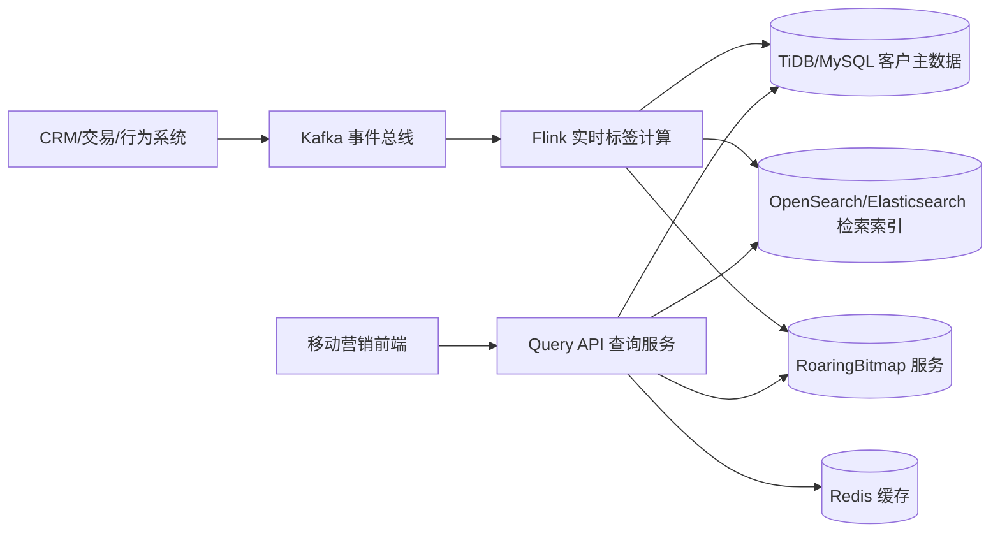

# 客户标签筛选系统详细技术方案

## 1. 背景与目标

### 1.1 业务背景
- 客户规模约 **3000 万**。
- 标签规模约 **200+**，标签由客户业务属性实时/准实时计算得出。
- 移动营销场景需要高频查询“某业务员名下全部客户 + 标签信息”。
- 需要支持多标签组合筛选（AND / OR / NOT）及动态交互。

### 1.2 建设目标
- 支持业务员维度的高频检索与多标签组合过滤。
- 在高并发下保持低延迟和稳定吞吐。
- 标签变更可快速生效（秒级最终一致）。
- 架构可水平扩展，支持后续标签数量和客户规模继续增长。

### 1.3 目标指标（建议）
- 查询延迟：`P95 < 200ms`，`P99 < 400ms`（常见筛选场景）。
- 标签更新可见性：`< 5s`（端到端）。
- 可用性：查询服务 `99.95%+`。
- 支持业务员热点流量保护与降级。

---

## 2. 总体架构设计

## 2.1 架构概览



## 2.2 分层职责
- **TiDB/MySQL（权威数据层）**：客户主档、业务归属、规则元数据。
- **Kafka + Flink（计算与同步层）**：标签实时计算、增量同步到检索/位图。
- **OpenSearch（检索层）**：过滤、分页、排序、字段返回。
- **RoaringBitmap（集合计算层）**：多标签布尔运算、候选集快速预过滤、标签计数。
- **Redis（缓存层）**：查询结果短缓存、热点业务员缓存、字典缓存。
- **Query API（服务层）**：统一对外查询协议、执行计划选择、降级与熔断。

---

## 3. 技术选型与理由

## 3.1 数据库（TiDB/MySQL）
- 作为交易主存，保证写入正确性和可对账能力。
- 存储强一致核心字段，不承担复杂检索压力。

## 3.2 检索引擎（OpenSearch/Elasticsearch）
- 天然支持多条件过滤、聚合、排序和分页。
- 对标签数组（keyword）检索友好，适合交互式筛选。

## 3.3 位图引擎（RoaringBitmap）
- 标签筛选本质是集合运算，位图适合 `AND/OR/NOT`。
- 对海量 ID 集合运算高效，明显降低复杂标签组合查询时延。

## 3.4 实时计算（Kafka + Flink）
- 可处理实时标签计算、事件乱序、状态管理和幂等落地。
- 支持标签规则扩展与持续演进。

---

## 4. 数据模型设计

## 4.1 关键 ID 设计
- `cust_id`：业务主键（字符串或长整型，外部展示）。
- `cust_int_id`：内部稠密整数 ID（建议 `uint32/uint64`），用于位图映射。
- `salesman_id`：业务员标识，所有查询入口主过滤条件。

> 建议维护 `cust_id <-> cust_int_id` 映射表，并提供批量转换接口。

## 4.2 关系库表（示意）

### `customer_profile`
- `cust_id` (PK)
- `cust_int_id` (UNIQUE)
- `salesman_id` (INDEX)
- `name`, `mobile_masked`, `region`, `level`, `status`
- `last_active_time`
- `updated_at`

### `customer_tag_snapshot`
- `cust_id` (PK)
- `tag_ids_json`（标签快照，审计与兜底）
- `tag_version`
- `updated_at`

### `tag_definition`
- `tag_id` (PK)
- `tag_code` (UNIQUE)
- `tag_name`
- `calc_type`（规则型/模型型/离线导入）
- `rule_version`
- `enabled`

## 4.3 检索文档模型（OpenSearch）

索引：`customer_search_v1`

```json
{
  "mappings": {
    "properties": {
      "cust_id": {"type": "keyword"},
      "cust_int_id": {"type": "long"},
      "salesman_id": {"type": "keyword"},
      "tags": {"type": "keyword"},
      "name": {"type": "keyword"},
      "region": {"type": "keyword"},
      "level": {"type": "keyword"},
      "status": {"type": "keyword"},
      "last_active_time": {"type": "date"},
      "updated_at": {"type": "date"},
      "tag_version": {"type": "long"}
    }
  }
}
```

---

## 5. 索引与分片策略

## 5.1 OpenSearch 分片建议
- 30M 文档建议起步 `24~48` 主分片（按节点规模调优）。
- 副本数 `1` 起步，保障可用性和读扩展。
- 单分片大小建议控制在 `20~50GB`。

## 5.2 路由策略
- 写入和查询均使用 `routing = salesman_id`，降低跨分片查询开销。
- 业务员热点明显时可对特大业务员进行拆分路由（如 `salesman_id#bucket`）。

## 5.3 查询策略
- 所有筛选条件放到 `filter` 上下文，避免打分开销。
- 使用 `search_after` 游标分页，避免深分页性能退化。
- `_source` 仅返回必要字段，详情字段按需回源。

---

## 6. 位图层设计（核心加速）

## 6.1 Key 规范
- `bm:salesman:{salesman_id}`：该业务员名下客户集合（cust_int_id）。
- `bm:tag:{tag_id}`：拥有该标签的客户集合。
- （可选热点）`bm:salesman:{salesman_id}:tag:{tag_id}`：极热场景预聚合。

## 6.2 查询表达式执行

给定条件：
- `must_tags = [T1, T8]`
- `should_tags = [T3, T5]`
- `must_not_tags = [T9]`

执行逻辑（示意）：
1. `S = bm:salesman:{id}`
2. `M = bm:tag:T1 AND bm:tag:T8`
3. `O = bm:tag:T3 OR bm:tag:T5`（若 should 为空则跳过）
4. `N = bm:tag:T9`
5. `R = S AND M AND O AND NOT N`

将 `R` 作为候选集用于后续分页与详情返回。

## 6.3 标签计数（facets）
- 当前上下文候选集为 `Base`。
- 计算 `count(tag_i) = cardinality(Base AND bm:tag:i)`。
- 200 标签并行批量计算，结果短缓存（10~30s）。

---

## 7. 查询服务设计

## 7.1 对外接口

### `POST /api/v1/customers/search`
请求体示例：

```json
{
  "salesman_id": "S10086",
  "must_tags": ["T1", "T8"],
  "should_tags": ["T3", "T5"],
  "must_not_tags": ["T9"],
  "filters": {
    "region": ["CN-SH"],
    "level": ["A", "B"]
  },
  "sort": [{"last_active_time": "desc"}, {"cust_int_id": "asc"}],
  "page_size": 50,
  "cursor": "opaque-token"
}
```

响应体示例：

```json
{
  "items": [
    {
      "cust_id": "C123",
      "name": "张三",
      "region": "CN-SH",
      "level": "A",
      "tags": ["T1", "T8"]
    }
  ],
  "next_cursor": "opaque-token-2",
  "total_hint": 12680
}
```

### `POST /api/v1/customers/facets`
- 输入：当前筛选上下文。
- 输出：标签可选数量，用于前端动态筛选面板。

## 7.2 执行计划（自适应）

1. **普通模式（纯 ES）**  
   条件较简单、候选集较大时，直接 ES filter + search_after。

2. **位图预过滤模式（Bitmap + ES）**  
   标签组合复杂或高并发时，先 Bitmap 计算候选，再 ES 做排序分页和字段过滤。

3. **降级模式（稳定性优先）**  
   Bitmap 服务异常时自动降级到纯 ES；ES 聚合超时时降级为无 facets。

---

## 8. 标签计算与数据同步

## 8.1 事件输入
- 客户属性变更事件
- 交易行为事件
- 外部评分/模型输出事件

统一进入 Kafka Topic（建议按域拆分）。

## 8.2 Flink 作业逻辑（示意）
1. 以 `cust_id` 为 keyBy，确保单客户顺序。
2. 根据规则引擎计算标签增量（新增、移除）。
3. 生成 `tag_version` 并输出到多 Sink：
   - Upsert 至 OpenSearch；
   - 对 Bitmap 执行 add/remove；
   - 可选写入 `customer_tag_snapshot` 审计表。

## 8.3 一致性策略
- 查询侧采用“**秒级最终一致**”。
- Sink 幂等：`(cust_id, tag_version)` 去重。
- 防乱序覆盖：仅当新版本 `tag_version` 更大时更新。

---

## 9. 缓存策略

## 9.1 缓存对象
- 查询结果页缓存：`query_hash + cursor`，TTL 10~30s。
- facets 缓存：`query_hash`，TTL 10~30s。
- 标签定义字典缓存：TTL 分钟级。

## 9.2 缓存注意事项
- 键包含 `salesman_id`，防止越权数据串读。
- 设置最大对象大小，避免大对象冲击 Redis。
- 对热点 query_hash 做本地缓存 + Redis 二级缓存。

---

## 10. 容量与性能规划

## 10.1 粗略容量估算方法
- 文档容量 ≈ `客户数 * 单文档平均大小 * (1 + 副本数) * 索引开销系数`
- 位图容量与客户 ID 稠密度和标签覆盖率有关，Roaring 可显著压缩。
- Kafka 保留策略按回溯需求设置（如 3~7 天）。

## 10.2 压测维度
- 按业务员客户数分层压测（小/中/大业务员）。
- 按标签表达式复杂度压测（1个、5个、20个组合）。
- 按并发阶梯压测（持续 + 突发）。

## 10.3 关键监控指标
- API：QPS、P95/P99、超时率、错误率。
- ES：慢查询、线程池拒绝、heap 使用、segment merge。
- Bitmap：运算耗时、内存占用、热点 key 分布。
- Flink：反压、checkpoint 时长、消费延迟。

---

## 11. 高可用、容灾与安全

## 11.1 高可用
- Kafka、ES、Redis、Flink 全部跨可用区部署。
- 查询服务无状态多副本，支持自动扩缩容。
- 熔断、限流、超时控制全链路启用。

## 11.2 容灾策略
- 关键存储多副本；定期快照与恢复演练。
- 灰度开关：可从 Bitmap+ES 快速切换到纯 ES。

## 11.3 安全与合规
- 客户敏感字段（手机号等）脱敏返回。
- 接口按业务员数据权限校验（ABAC/RBAC）。
- 全链路审计日志与访问追踪。

---

## 12. 实施路线（建议）

## Phase 1：基础能力上线
- 建成 `TiDB/MySQL + Kafka + Flink + OpenSearch`。
- 完成基础检索、标签筛选、分页排序、权限校验。

## Phase 2：性能增强
- 引入 RoaringBitmap 预过滤与 facets 加速。
- 增加查询结果缓存与热点防护。

## Phase 3：治理与优化
- 标签规则平台化（版本管理、灰度发布、回放校验）。
- 完成离线对账与修复任务，持续优化资源成本。

---

## 13. 风险与应对

- **风险：热点业务员导致分片倾斜**  
  应对：拆分路由、热点隔离、请求限流。

- **风险：标签更新延迟抖动**  
  应对：Flink 反压治理、Kafka 分区扩容、异步重试队列。

- **风险：复杂筛选导致查询超时**  
  应对：位图预过滤、超时降级、限制单次标签组合复杂度。

- **风险：多源事件乱序覆盖**  
  应对：版本号 compare-and-set、幂等写入。

---

## 14. 验收清单

- [ ] 支持业务员名下客户检索与 200+ 标签组合筛选。  
- [ ] 常见查询满足 `P95 < 200ms`。  
- [ ] 标签更新端到端可见延迟 `< 5s`。  
- [ ] 服务在单组件故障时可降级可恢复。  
- [ ] 完成监控告警、压测报告和容灾演练记录。  

